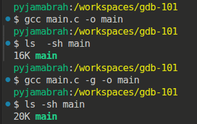

# Reading Notes — Course Index

- **Maintainer:** Notes for personal study and future additions
- **Date created:** 2026-02-14
- **Last updated:** 2026-02-14

## Purpose

This file is a living index of short reading notes for the course. Keep entries brief, searchable, and linkable so additions remain maintainable as the course progresses.

## Table of Contents

- Index of entries
- Entry template (how to add)
- Commands (quick reference)
- Assets and references
- Changelog

## Index of Entries

- GCC `-g` (Debug symbols) — 2026-02-14 — see: [GCC `-g` and debug symbols](#gcc-g-and-debug-symbols)

## Entry 1: GCC `-g` and debug symbols

- **Date:** 2026-02-14
- **Source/context:** [main.c](main.c)
- **Tags:** gcc, debugging, build

Summary:

`-g` embeds debug symbols in the binary. This improves debugger output (e.g., `gdb`) but increases binary size.

Key points:

- Debug symbols include symbol and line information.
- Binary size increases with `-g`; use `strip` or omit `-g` for release builds.
- Optimization flags (e.g., `-O2`) can make debugging harder even with `-g`.

Commands:

```
gcc main.c -o main
gcc main.c -g -o main

# To launch gdb:
gdb main
gdb -q main # doesn't show the welcome message

# Understand the file size
ls -sh main

# Understand the file type
file main

# Commands to run inside of gdb session:
(gdb) break main # Set a breakpoint at the main function

(gdb) break 6 # Set a breakpoint at line 6

(gdb) run # Start the program

(gdb) backtrace/bt # Show the call stack

(gdb) info locals # Show local variables in the current
stack frame

(gdb) print variable_name # Print the value of a variable

(gdb) next # Step to the next line of code (without stepping into functions)
```

Notes:

- Use `-g` during development. For distribution, build without `-g` or `strip` the binary.

References/Assets:



## Entry Template (how to add a new note)

Use the following minimal structure for each new entry to keep things consistent:

- **Title:** Short descriptive title
- **Date:** YYYY-MM-DD
- **Source/context:** file or lecture reference
- **Tags:** comma-separated tags
- **Summary:** 1–2 lines
- **Key points:** bullet list
- **Commands:** code block of commands
- **Notes:** additional commentary
- **References:** links to assets or files

Example (copy and paste to add):

```
- **Title:** Example topic
- **Date:** 2026-02-14
- **Source/context:** lecture X or file Y
- **Tags:** tag1, tag2

Summary:

Short summary here.

Key points:

- Point 1
- Point 2

Commands:

```
example-command --flag
```

Notes:

Extra notes here.

References:

- link/to/resource
```

## Commands (quick reference)

- Compile without debug info: `gcc main.c -o main`
- Compile with debug info: `gcc main.c -g -o main`

## Assets

- [assets/Binary_Size.md](assets/Binary_Size.md)

## Changelog

- 2026-02-14: Created generic reading-notes template and added GCC `-g` entry.

